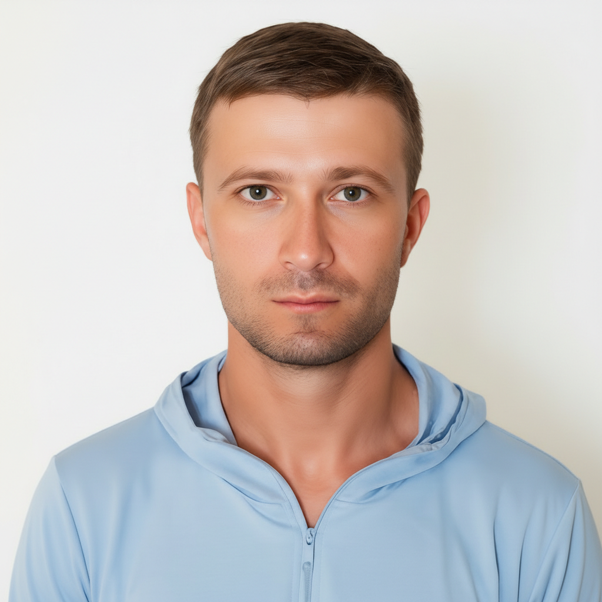
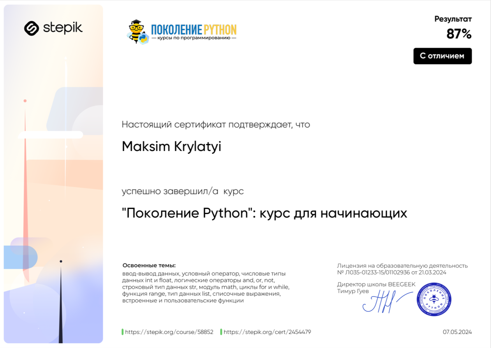
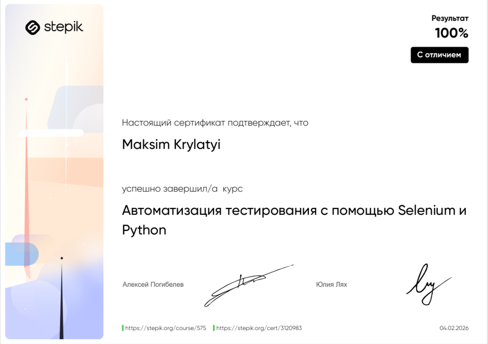
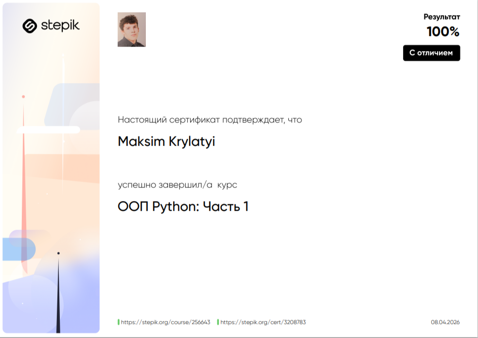

# Resume

# Крылатый Максим Алексеевич

**Дата рождения:** 11.01.1984г.  
**Адрес:** г. Санкт-Петербург, пр. Комендантский, д. 16, к.2, кв.46  
**E-mail:** [krylatiy2@mail.ru](mailto:krylatiy2@mail.ru)  
**LinkedIn:** [www.linkedin.com/in/maksim-krylatiy](https://www.linkedin.com/in/maksim-krylatiy)  
**GitHub:** [https://github.com/Yvagaemiy](https://github.com/Yvagaemiy)  
**Телеграм:** [@Maksim_Alekseevich_11](https://t.me/Maksim_Alekseevich_11)  
**Телефон:** +7 952 241 29 27

---

## 1. Желаемая должность и зарплата

| Параметр | Значение |
|-----------|---------|
| Желаемая должность | Стажер QA Engineer, CA Engineer-Junior, Software Tester-Junior |
| Тип занятости:|  Постоянная работа |
| График работы | Гибрид, На месте работодателя |

**Профессиональное резюме**  
QA Engineer с профильным обучением (2 года) и завершённым курсом повышения квалификации по тестированию ПО. Имею практический опыт ручного тестирования, составления тестовой документации и работы с баг-трекинговыми системами. Обладаю сильным бэкграундом в контроле качества и анализе процессов благодаря многолетнему управленческому опыту в производственной сфере. Нацелен на развитие в области тестирования и обеспечения качества программного обеспечения.

---

## 2. Опыт работы

**Geek Brains — : Software Tester**  
_Январь 2023 — Ноябрь 2025_

**Обязанности:**  
- Производил функциональное тестирование веб-сайта по составленным мною чек-листам и тест-кейсам в процессе обучения: проверял форму регистрации, кнопки и действия, переходы между страницами, обработку ошибок ввода, бизнес-логику и т.д.
- Работал в баг-трекинговых системах Jira, заводил и вел баг-репорты в процессе обучения, оформлял дефекты с подробным описанием шагов воспроизведения, фактического и ожидаемого результата, а также приоритета и степени серьезности.
- Работал с DevTools браузера в процессе обучения: использовал инструменты разработчика для анализа структуры страницы, проверки сетевых запросов (Network), -поиска и воспроизведения багов, связанных с отображением и работой интерфейс.
*Ссылка на гугл таблицу: https://drive.google.com/drive/folders/1lnuqJD3wejAikoiGjT6NhMsMaC7jNc71?usp=drive_link*
	
- Работал с Postman в процессе обучения: отправлял HTTP-запросы (GET, POST, PUT, DELETE), настраивал headers и body (JSON), использовал JavaScript в сниппетах для проверки статус-кодов и данных в ответе, выполнял базовое нагрузочное тестирование API.
*Ссылка на гугл таблицу: https://drive.google.com/drive/folders/171OfU__prc3nDwfVRXAadOGYObhOQsqE?usp=drive_link*

- Проводил в процессе обучения UI-тестирование: проверка внешнего вида, удобства использования и соответствия макетам.

- Проводил автоматизированное тестирование на Python в процессе обучения: использовал Selenium WebDriver для автоматизации UI-тестов, создавал структурированные тесты с применением Pytest, проверял базовый функционал веб-приложений (переходы по страницам, работу элементов интерфейса и валидацию данных).
*Ссылка на GitHub:https://github.com/Yvagaemiy/Slelenium_Stepik.git*
 
## 3. Образование

| Учебное заведение | Период | Курс / Специальность |
|------------------|--------|--------------------|
| GeekBrains | 2025 | QA Engineer, CA Engineer, Software Tester |
| СПбГИЭУ «ИНЖЭКОН» | 2008 | Коммерция  |
| Радиотехнический профессиональный лицей №1 | 2003 | слесарь-механик РЭАиПр (5 разряд), слесарь-сборщик РЭАиПр (5 разряд) |

---

## 4. Дополнительные навыки и знания

Базовые знания Python, JavaScript (проверки status code). Понимание основных принципов разработки.

### Программирование
- **Python**: [GitHub](https://github.com/Yvagaemiy/Lekturi_vidio.git)  

### Контроль версий
- Git: работа с Git для отслеживания изменений и совместной разработки

### Базы данных
- Понимание основ SQL и умение составлять простые запросы  
- [Ссылка на Google-таблицу](https://docs.google.com/spreadsheets/d/1vFNJtz7z_ZZjynQXiU9N_L9Jx1C-I4D9QH4igBiXnBo/edit?usp=sharing)

### Веб-разработка
- Основы HTTP, HTML, CSS, JavaScript для создания веб-страниц  
- [Ссылка на GitHub](https://github.com/Yvagaemiy/First_HTML_CSS.git)

---

## 5. Soft Skills

- Аналитическое мышление.
- Повышенное внимание к деталям.
- Коммуникабельность и умение находить общий язык.
- Эффективная работа в команде.
- Умение решать сложные проблемы.
- Умение эффективно работать в условиях многозадачности.
- Обучаемость.

---

## 6. Дополнительная информация

- Знание иностранных языков — уровень Beginner  
- Хобби: спорт, путешествия  

---
## 7. Дополнительные курсы и сертификаты:
- Курс: "Поколение Python": курс для начинающих
- Ссылка: https://stepik.org/cert/2454479
- 
- Курс: Автоматизация тестирования с помощью Selenium и Python
- Ссылка: https://stepik.org/cert/3120983
- 
- Курс: ООП Python: Часть 1
- Ссылка: https://stepik.org/cert/3208783
- 
- Курс: Симулятор SQL lab.karpov.courses

## Кратко о себе

**Профессиональный опыт:**  
АО «ВОДТРАНСПРИБОР» — начальник участка антенно-аппаратного производства  

- Организация процесса контроля качества на нескольких производственных участках: подготовка продукции к предъявлению в отдел контроля качества (ОКК), оформление сопроводительной документации и протоколов  
- Проведение входного контроля материалов и сборочных единиц, составление протоколов и актов несоответствия  
- Участие в периодических, приёмочных и квалификационных испытаниях изделий и узлов  
- Контроль технологической дисциплины, проведение инструктажей по охране труда и безопасности процесса  
- Анализ отказов и неисправностей, документирование причин и внедрение корректирующих мер; запись замечаний в журнал технологических/конструкторских замечаний  
- Взаимодействие с отделами главного технолога и главного конструктора по изменению технологий и методик проверок  
- Организация поверки и аттестации измерительного и испытательного оборудования, взаимодействие с представителями заказчика при приёмке (ВП МО РФ)  
- Руководство коллективом до 40 человек: распределение работ, обучение, повышение квалификации и ответственности сотрудников  

**Достижения:** 
- Полный перенос производства на новую площадку 
- Расширение двух участков до полноценного функционирующего производства; расширение штата с 10 до 40 человек  
- Улучшение производственных процессов через внедрение корректирующих мер и предложений в технологические карты
 

**Ключевые навыки:**  
- Контроль качества и приёмка продукции  
- Проведение испытаний: входной контроль, периодические/квалификационные испытания  
- Анализ причин отказов, инициирование корректирующих и предупреждающих мер  
- Разработка и внесение предложений в технологические инструкции и методики проверок  
- Организация поверок/калибровка оборудования  
- Документирование несоответствий, ведение отчётности  
- Управление командой, распределение работ, обучение и инструктаж персонала  
- Внимание к деталям, следование регламентам и требованиям заказчика  

**Дополнительно:**  
- Мой опыт работы начальником участка предоставил прочную основу для успешной карьеры в QA  
- Взаимодействие с техническими отделами развило мои коммуникативные навыки и ускорило процесс устранения отклонений и внедрения предупреждающих мер ещё до запуска заказа в производство  
- Моя цель — стать квалифицированным QA-инженером и внести свой вклад в успех вашей команды

